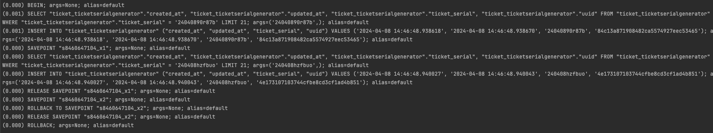

### Test History
1. 2024-04-06
   1. 중첩 prefetch_related
      1. Post 모델에 대한 모든 객체 조회.
      2. 모든 Post 객체에 대한 Subscriber 객체 조회. (post_id__in)
      3. 모든 Subscriber 객체에 대한 SubscriberFollower 객체 조회. (subscriber_id__in)
   2. annotate & subquery
      1. (SELECT U0."name" FROM "post_subscriber" U0 WHERE U0."post_id" = ("post_post"."id") ORDER BY U0."id" DESC LIMIT 1)
2. 2024-04-08
   1. django select_for_update
      1. select_for_update 사용 시, 트랜잭션 블록 내에서만 사용 가능.
      2. select_for_update는 Exclusive lock (배타적 잠금)
         - 쓰기 잠금. (for update)
         - Shared lock (공유 잠금)는 읽기 잠금. (for share)
   2. transaction atomic
      1. 주어진 블록의 원자 실행을 보장한다.
      2. 데코레이터 혹은 컨텍스트 관리자로 사용할 수 있다.
      3. 트랜잭션 범위는 중첩될 수 있고, 제일 안쪽 트랜잭션이 롤백되면 바깥쪽 트랜잭션도 롤백된다.
      4. 